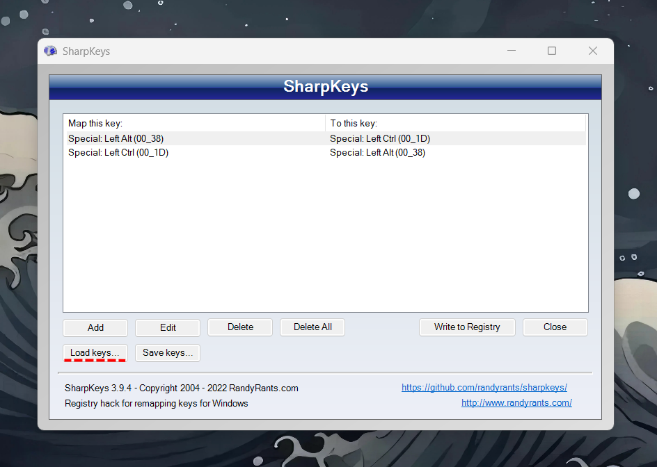

# MacOS Keyboard Behavior in Windows

  
This [AutoHotKey script](mac.ahk) seeks to deliver all the **superior** MacOS keyboard behavior you love in Windows!

## Prerequisites
1. A Windows-style keyboard; this solution is not designed to work with a Mac keyboard

2. [AutoHotKey](https://www.autohotkey.com/) installed on your PC. This script uses **AHK V2**

3. Swap your Ctrl and Alt keys using [SharpKeys](https://github.com/randyrants/sharpkeys/releases). Open SharpKeys and Load keys "swapkeys.skl"
			-	Note: I would reccomend physically changes the key caps around or placing stickers on top.

---

## Usage
1. [Prerequisites](#prerequisites) first!

2. Create a new `mac.ahk` file in the location of your choice. I recommend `~/Documents/AutoHotKey/mac.ahk`.

3. Open your newly created file in a text editor such as Notepad.

4. Copy the contents of [mac.ahk](mac.ahk) into the file you created and save changes.

5. Run the file by double-clicking it in Windows Explorer.

6. Optionally, you can use Ahk2Exe and turn script to exe place in startup folder (If you want an icon use mac.ico).
        - This lets the script will start whenever you start the your computer.

---

#### IMPORTANT NOTE
The list of keyboard shortcuts below is formatted Apple-style. Use this keymap to perform these shortcuts in Windows:
- `Command` = `Alt` key
- `Option` = `Windows` key
- `Control` = `Ctrl` key

If any shortcut is missing, try add yourself or use ChatGPT.
### Cut, copy, paste, and other common shortcuts
- [x] Command-X: Cut the selected item and copy it to the Clipboard.
- [x] Command-C: Copy the selected item to the Clipboard.
- [x] Command-V: Paste the contents of the Clipboard into the current document or app.
- [x] Command-Z: Undo the previous command. You can then press Shift-Command-Z to Redo, reversing the undo command.
- [x] Command-A: Select All items.
- [x] Command-F: Find items in a document or open a Find window.
- [x] Command-O: Open the selected item, or open a dialog to select a file to open.
- [x] Command-P: Print the current document.
- [x] Command-S: Save the current document.
- [x] Command-T: Open a new tab.
- [x] Command-W: Close the front window.
- [x] Command-Q: Quit app.
- [x] Command–Space bar: I recommend Flow Launcher
- [x] Command-Tab: Switch to the next most recently used app among your open apps. 
- [x] Shift-Command-N: Create a new folder in the Finder.

### Finder and system shortcuts
- [x] Shift-Command-N: Create a new folder.
- [x] Command-N: Open a new Finder window.

### Document shortcuts
The behavior of these shortcuts may vary with the app you're using.

- [x] Command-B: Boldface the selected text, or turn boldfacing on or off. 
- [x] Command-I: Italicize the selected text, or turn italics on or off.
- [x] Command-K: Add a web link.
- [x] Command-U: Underline the selected text, or turn underlining on or off.
- [x] Command–Up Arrow: Move the insertion point to the beginning of the document.
- [x] Command–Down Arrow: Move the insertion point to the end of the document.
- [x] Command–Left Arrow: Move the insertion point to the beginning of the current line.
- [x] Command–Right Arrow: Move the insertion point to the end of the current line.
- [x] Command–Backspace: Delete the line to the left of the insertion point.
- [x] Option–Left Arrow: Move the insertion point to the beginning of the previous word.
- [x] Option–Right Arrow: Move the insertion point to the end of the next word.
- [x] Option–Up Arrow: Alt + Up
- [x] Option–Down Arrow: Alt + Down
- [x] Option–Backspace: Delete the word to the left of the insertion point.
- [x] Shift–Command–Up Arrow: Select the text between the insertion point and the beginning of the document.
- [x] Shift–Command–Down Arrow: Select the text between the insertion point and the end of the document.
- [x] Shift–Command–Left Arrow: Select the text between the insertion point and the beginning of the current line.
- [x] Shift–Command–Right Arrow: Select the text between the insertion point and the end of the current line.
- [x] Shift–Up Arrow: Extend text selection to the nearest character at the same horizontal location on the line above.
- [x] Shift–Down Arrow: Extend text selection to the nearest character at the same horizontal location on the line below.
- [x] Shift–Left Arrow: Extend text selection one character to the left.
- [x] Shift–Right Arrow: Extend text selection one character to the right.
- [x] Option–Shift–Up Arrow: Extend text selection to the beginning of the current paragraph, then to the beginning of the following paragraph if pressed again.
- [x] Option–Shift–Down Arrow: Extend text selection to the end of the current paragraph, then to the end of the following paragraph if pressed again.
- [x] Option–Shift–Left Arrow: Extend text selection to the beginning of the current word, then to the beginning of the following word if pressed again.
- [x] Option–Shift–Right Arrow: Extend text selection to the end of the current word, then to the end of the following word if pressed again.
